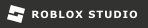

Hi, I'm Hyde
---
## About Me

Computer Science Accelerated BS/MS student @ University of Oklahoma with an Economics minor.
Focused on software engineering across the stack, with a preference for backend systems.
I enjoy building independent projects and game systems on Roblox, with an interest in large-scale game architecture and design.
Curious about robotics and real-world autonomy systems.
Currently seeking SWE internship opportunities.

## Languages

  
  
  
  
  
  
  
  

## Technologies

  
  
  
  

## Tools

  
  
  
  

